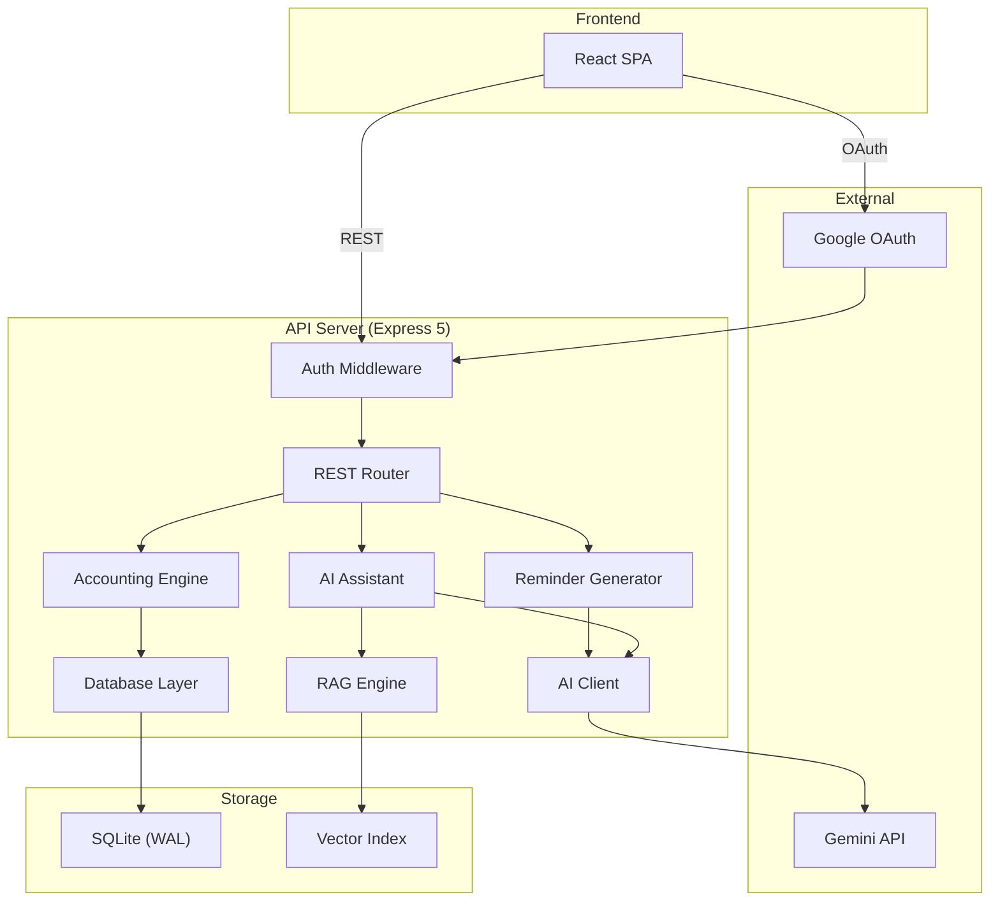

<div align="center">

# subscription-billing

**A self-hosted subscription billing console for shared service management.**

Manage members, track payments, generate invoices, and reconcile accounts — all from a single dashboard with built-in AI assistance.

[](https://github.com/nnnc8/subscription-billing/actions/workflows/verify.yml)
[](https://www.typescriptlang.org)
[](https://nodejs.org)
[](LICENSE)

</div>

---

## Features

- 📊 **Dashboard** — Real-time balance tracking, receivables overview, and collection rate metrics
- 👥 **Member Management** — Add, archive, and track subscription members with per-member pricing
- 💳 **Payment Recording** — Log payments with duplicate detection, void support, and full audit trail
- 📋 **Monthly Settlement** — Automated month-close with balance carryover and readiness checks
- ⚡ **AI Automation Inbox** — Paste natural language text; Gemini parses → validates → auto-applies or queues for review
- 🤖 **AI Assistant** — Natural language billing queries powered by Google Gemini with function calling
- 🔍 **RAG Search** — Vector-indexed transaction history for context-aware AI responses
- ✉️ **Invoice Generation** — AI-generated payment reminders in 5 tones (friendly, formal, pirate, poetic, urgent)
- 🔒 **Google OAuth** — Allowlisted email authentication with signed HttpOnly session cookies
- 🛡️ **Tamper-Evident Ledger** — SHA-256 hash-linked event chain for audit integrity
- 💾 **Backup & Restore** — Timestamped snapshots with restore-impact previews

## Tech Stack

| Layer | Technology |
|-------|-----------|
| Frontend | React 19, Vite 8 |
| Backend | Express 5, TypeScript ESM |
| Database | SQLite (WAL mode) via `better-sqlite3` |
| AI | Google Gemini (AI Studio / Vertex AI) |
| Auth | Google OAuth 2.0 |
| Testing | Vitest |
| Deployment | Docker, macOS LaunchAgent |

## Getting Started

### Prerequisites

- [Node.js](https://nodejs.org) 22+
- [pnpm](https://pnpm.io) 11+
- A [Google Cloud Console](https://console.cloud.google.com) project with OAuth credentials

### Installation

```bash
git clone https://github.com/nnnc8/subscription-billing.git
cd subscription-billing
pnpm install
```

### Configuration

```bash
cp .env.example .env
```

Edit `.env` with your credentials:

```env
PORT=3000
HOST=127.0.0.1
APP_SESSION_SECRET=<random-32-char-string>
GOOGLE_CLIENT_ID=<your-oauth-client-id>
GOOGLE_CLIENT_SECRET=<your-oauth-client-secret>
GOOGLE_ALLOWED_EMAILS=you@example.com
GOOGLE_GEMINI_API_KEY=<your-gemini-api-key>  # Optional, enables AI features
```

### Running

**Development** (hot reload):

```bash
pnpm dev      # Vite dev server (frontend)
pnpm api      # Express API server (backend)
```

**Production**:

```bash
pnpm run build
pnpm start
```

Open [http://localhost:3000](http://localhost:3000) and sign in with an approved Google account.

## Architecture



## Project Structure

```
subscription-billing/
├── server.ts                # Express API server
├── src/
│   ├── App.jsx              # Main React application
│   ├── components/
│   │   ├── AutomationTab.jsx    # ⚡ AI Automation Inbox UI
│   │   ├── AiAssistantTab.tsx   # AI chat assistant
│   │   ├── HistoryTab.tsx
│   │   └── SubscriptionsTab.tsx
│   ├── types/               # TypeScript type definitions
│   └── index.css            # Design system
├── lib/
│   ├── automation.ts        # ⚡ AI parsing + validation + apply logic
│   ├── accounting.ts        # Accounting engine & ledger
│   ├── ai.ts                # Gemini AI client
│   ├── ai-assistant.ts      # Function-calling chat agent
│   ├── ai-reminder.ts       # Invoice text generation
│   ├── rag.ts               # Vector search & indexing
│   ├── db.ts                # SQLite database layer
│   ├── auth.ts              # Session & cookie auth
│   └── google-oauth.ts      # OAuth flow handler
├── tests/
│   ├── automation.test.ts   # ⚡ Automation pipeline tests
│   ├── accounting.test.ts
│   ├── portability.test.ts
│   └── privacy.test.ts
├── docs/                    # Documentation
├── Dockerfile               # Multi-stage container build
└── docker-compose.yml       # Container orchestration
```

## Testing

```bash
# Unit tests (Vitest)
pnpm test

# Full verification pipeline (auth, privacy, accounting, portability)
pnpm run verify

# Linting
pnpm run lint
```

## Deployment

### Docker

```bash
docker compose up --build -d
```

### macOS Background Service

```bash
pnpm run launchd:install    # Install as LaunchAgent
pnpm run launchd:uninstall  # Remove service
```

## API Reference

| Method | Endpoint | Description |
|--------|----------|-------------|
| `GET` | `/api/data` | Full application state |
| `POST` | `/api/payment` | Record a payment |
| `DELETE` | `/api/payment/:id` | Void a payment |
| `POST` | `/api/temp-charge` | Record a temporary charge |
| `POST` | `/api/update-config-bundle` | Batch update settings |
| `GET` | `/api/close-preview` | Month-close readiness check |
| `POST` | `/api/settle` | Execute monthly settlement |
| `POST` | `/api/ai/chat` | AI assistant conversation |
| `POST` | `/api/ai/generate-reminder` | Generate invoice text |
| `POST` | `/api/automation/ingest` | ⚡ Parse natural language → proposals |
| `GET` | `/api/automation/inbox` | List session proposals |
| `POST` | `/api/automation/confirm/:id` | Apply a pending proposal |
| `POST` | `/api/automation/reject/:id` | Reject a pending proposal |
| `GET` | `/api/backups` | List backup snapshots |
| `POST` | `/api/backups/create` | Create backup |
| `POST` | `/api/backups/restore` | Restore from backup |

## Contributing

1. Fork the repository
2. Create a feature branch (`git checkout -b feat/new-feature`)
3. Commit changes using [Conventional Commits](https://www.conventionalcommits.org) (`feat:`, `fix:`, `docs:`)
4. Push and open a Pull Request

## License

MIT © 2026

---

## 🎯 Tagtoo GenAI Demo（3 分鐘展示流程）

> 本節說明如何在 3 分鐘內展示本系統的 GenAI 工程能力，對應 Tagtoo 生成式 AI 實習生職缺關鍵技術。

### 技術關鍵字對應

| Tagtoo JD 關鍵字 | 本系統對應實作 |
|---|---|
| 生成式 AI / LLM | Gemini 2.0 Flash — 多輪對話、function calling |
| RAG | `lib/rag.ts` — 向量嵌入 + cosine 相似度索引 |
| 自動化流程 | `lib/automation.ts` — AI 解析 → 驗證 → 受控寫入 |
| 資料應用 | SQLite WAL + 帳務引擎 + ledger hash chain |
| GitHub | [nnnc8/subscription-billing](https://github.com/nnnc8/subscription-billing) |
| GCP / Gemini | `GOOGLE_GEMINI_API_KEY` + AI Studio / Vertex AI fallback |
| AI-assisted development | 所有 AI 操作均有 deterministic validation 守門 |

---

### Step 1 — RAG + Function Calling 查詢（~60s）

在左側切換到 **✨ AI 助理**，輸入：

```
誰這個月還沒繳錢？請幫我列出優先催繳順序。
```

系統行為：
1. **RAG 檢索**：將問題轉成向量，比對付款/訂閱/帳務歷史塊
2. **Gemini function calling**：呼叫 `get_collection_priority` tool
3. **Markdown table 回傳**：顯示應收金額排序、距上次付款天數、緊急度

---

### Step 2 — AI 自動化處理（~90s）

切換到 **⚡ 自動處理**，點「範例 1」或手動貼入：

```
王小明 轉 270
幫李小明 6 月開始加 Netflix
張大明 這個月額外收 50 網域費
```

系統行為：
1. **Gemini function calling**：解析成 3 筆 `AutomationProposal`（付款 / 訂閱 / 加帳）
2. **Deterministic 驗證**：查 member 是否存在、金額格式、`findRecentDuplicateTransaction`
3. **分類**：
   - 信心 ≥ 0.9 且驗證通過 → **自動套用**（寫入 SQLite + ledger + RAG invalidation）
   - 信心 < 0.9 或有 warning → **待確認**（Inbox 顯示，等人工確認）
   - 驗證失敗 → **被擋下**（不靜默丟棄，顯示原因）
4. **Inbox 即時更新**：綠色已套用 / 黃色待確認 / 紅色被擋下，每筆顯示 ledger event ID

---

### Step 3 — 稽核說明（~30s）

回到 **✨ AI 助理**，輸入：

```
剛才自動套用的事件，帳務都對了嗎？月底關帳還差什麼？
```

AI 呼叫 `get_month_close_checklist`，回傳：
- 未付成員列表
- 最近 `[AI自動]` 前綴的 ledger events
- 關帳 blockers / 通過項目

---

### 架構亮點（可在面試中說明）

```
User 貼文字
    │
    ▼
POST /api/automation/ingest
    │
    ├─ Gemini function calling (record_billing_events tool)
    │      └─ 回傳 structured proposals (JSON)
    │
    ├─ Deterministic Validator
    │      ├─ member lookup (唯一匹配，不靠 AI 決定)
    │      ├─ findRecentDuplicateTransaction()
    │      └─ amount / date / month 格式驗證
    │
    └─ Classifier (confidence >= 0.9 + 無 warnings)
           ├─ apply → writeDB() + appendLedgerEvent() + invalidateRAGIndex()
           ├─ pending → Inbox 待人工確認
           └─ rejected → 顯示原因，不靜默丟棄
```

> **設計原則**：AI 是解析 oracle，不是可信寫入者。所有真實 DB 操作都通過 deterministic 守門層。
