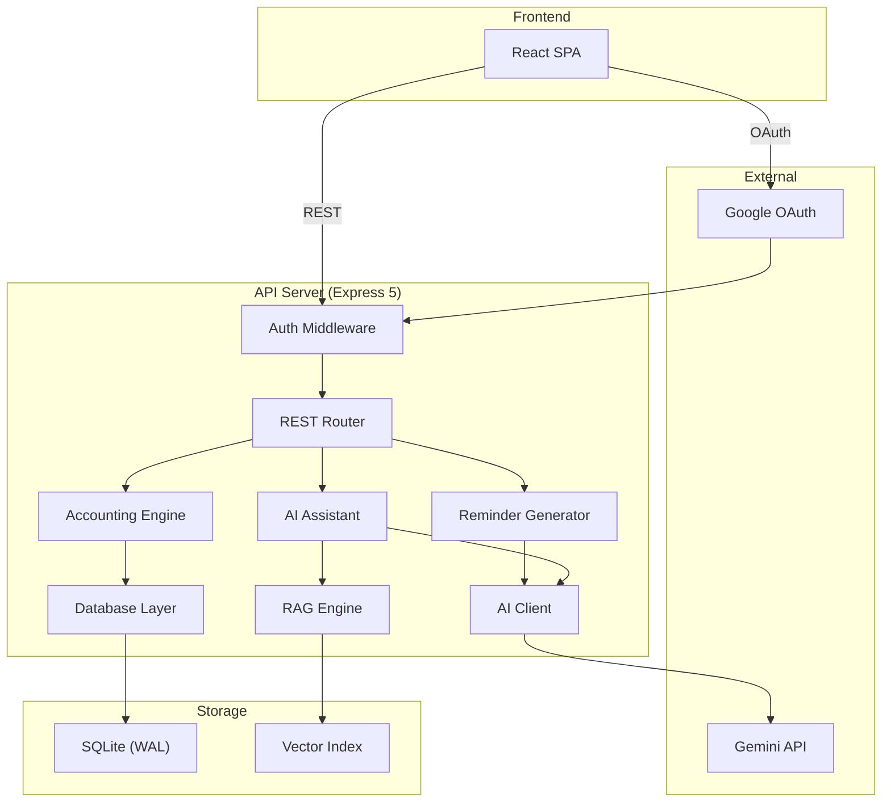

<div align="center">

# subscription-billing

**A self-hosted subscription billing console for shared service management.**

Manage members, track payments, generate invoices, and reconcile accounts — all from a single dashboard with built-in AI assistance.

[](https://github.com/nnnc8/subscription-billing/actions/workflows/verify.yml)
[](https://www.typescriptlang.org)
[](https://nodejs.org)
[](LICENSE)

</div>

---

## Features

- 📊 **Dashboard** — Real-time balance tracking, receivables overview, and collection rate metrics
- 👥 **Member Management** — Add, archive, and track subscription members with per-member pricing
- 💳 **Payment Recording** — Log payments with duplicate detection, void support, and full audit trail
- 📋 **Monthly Settlement** — Automated month-close with balance carryover and readiness checks
- ⚡ **AI Automation Inbox** — Paste natural language text; Gemini parses → validates → auto-applies or queues for review
- 🤖 **AI Assistant** — Natural language billing queries powered by the Google Gemini AI Studio API with function calling
- 🔍 **RAG Search** — Vector-indexed transaction history for context-aware AI responses
- ✉️ **Invoice Generation** — AI-generated payment reminders in 5 tones (friendly, formal, pirate, poetic, urgent)
- 🔒 **Google OAuth** — Allowlisted email authentication with signed HttpOnly session cookies
- 🛡️ **Tamper-Evident Ledger** — SHA-256 hash-linked event chain for audit integrity
- 💾 **Backup & Restore** — Timestamped snapshots with restore-impact previews

## Tech Stack

| Layer | Technology |
|-------|-----------|
| Frontend | React 19, Vite 8 |
| Backend | Express 5, TypeScript ESM |
| Database | SQLite (WAL mode) via `better-sqlite3` |
| AI | Google Gemini AI Studio API (optional; no Vertex runtime) |
| Auth | Google OAuth 2.0 |
| Testing | Vitest |
| Deployment | Docker, macOS LaunchAgent |

## Getting Started

### Prerequisites

- [Node.js](https://nodejs.org) 22.12+
- [pnpm](https://pnpm.io) 11+
- A [Google Cloud Console](https://console.cloud.google.com) project with OAuth credentials

### Installation

```bash
git clone https://github.com/nnnc8/subscription-billing.git
cd subscription-billing
pnpm install
```

### Configuration

```bash
cp .env.example .env
```

Edit `.env` with your credentials:

```env
PORT=3000
HOST=127.0.0.1
APP_SESSION_SECRET=<random-32-char-string>
GOOGLE_CLIENT_ID=<your-oauth-client-id>
GOOGLE_CLIENT_SECRET=<your-oauth-client-secret>
GOOGLE_ALLOWED_EMAILS=you@example.com
GOOGLE_GEMINI_API_KEY=<your-gemini-api-key>  # Optional AI Studio key
PUBLIC_ORIGIN=http://127.0.0.1:3000
# ALLOWED_ORIGINS=https://billing.example.com
# TRUST_PROXY_CIDRS=10.0.0.0/8
```

### Running

**Development** (hot reload):

```bash
pnpm dev      # Vite dev server (frontend)
pnpm api      # Express API server (backend)
```

**Production** (the server entry is `server.ts`):

```bash
pnpm run build
pnpm start
```

Open [http://localhost:3000](http://localhost:3000) and sign in with an approved Google account.

## Architecture



## Project Structure

```
subscription-billing/
├── server.ts                # Express API server
├── src/
│   ├── App.tsx              # Main React application
│   ├── components/
│   │   ├── AutomationTab.tsx    # ⚡ AI Automation Inbox UI
│   │   ├── AiAssistantTab.tsx   # AI chat assistant
│   │   ├── HistoryTab.tsx
│   │   └── SubscriptionsTab.tsx
│   ├── types/               # TypeScript type definitions
│   └── index.css            # Design system
├── lib/
│   ├── automation.ts        # ⚡ AI parsing + validation + apply logic
│   ├── accounting.ts        # Accounting engine & ledger
│   ├── ai.ts                # Gemini AI client
│   ├── ai-assistant.ts      # Function-calling chat agent
│   ├── ai-reminder.ts       # Invoice text generation
│   ├── rag.ts               # Vector search & indexing
│   ├── db.ts                # SQLite database layer
│   ├── auth.ts              # Session & cookie auth
│   └── google-oauth.ts      # OAuth flow handler
├── tests/
│   ├── automation.test.ts   # ⚡ Automation pipeline tests
│   ├── accounting.test.ts
│   ├── portability.test.ts
│   └── privacy.test.ts
├── docs/                    # Documentation
├── Dockerfile               # Multi-stage container build
└── docker-compose.yml       # Container orchestration
```

## Testing

```bash
# Unit tests (Vitest)
pnpm test

# Full verification pipeline: lint, strict typechecks, coverage, legacy checks, build and bundle gate
pnpm run verify

# Linting
pnpm run lint
```

## Deployment

### Docker

```bash
docker compose up --build -d
```

The application stores `database.db`, its WAL/SHM files, and rotating backups only under `DATA_DIR` (the Compose volume is mounted at `/data`). Do not bake live data or secrets into an image. The disposable end-to-end smoke is:

```bash
scripts/docker-smoke.sh
```

The smoke uses a named temporary volume, dummy signed authentication, a dynamic host port, and removes the container/volume on exit. A fresh production volume must be initialized from an operator-approved database; the smoke alone uses the demo fixture with `MIGRATE_FROM_JSON=1`.

The server exposes 38 `/api` routes. `/api/health` returns 503 until atomic initialization, migration, lifecycle and domain checks are ready.

### macOS Background Service

```bash
pnpm run launchd:install    # Install as LaunchAgent
pnpm run launchd:uninstall  # Remove service
```

## API Reference

| Method | Endpoint | Description |
|--------|----------|-------------|
| `GET` | `/api/health`, `/api/auth/session`, `/api/auth/login` | Health and auth state/login |
| `GET` | `/api/auth/callback` | Google OAuth callback |
| `POST` | `/api/auth/logout` | End the local session |
| `GET` | `/api/data`, `/api/export-json` | Read state or download JSON attachment |
| `POST` | `/api/payment`, `/api/temp-charge` | Record billing transactions |
| `DELETE` | `/api/payment/:id`, `/api/temp-charge/:id` | Void transactions |
| `POST` | `/api/update-prices`, `/api/update-members`, `/api/update-subscriptions`, `/api/update-bank`, `/api/update-config-bundle` | Update settings and entities |
| `POST` | `/api/member`, `/api/platform` | Create entities |
| `DELETE` | `/api/member/:id`, `/api/platform/:id` | Archive/delete entities |
| `POST` | `/api/settle` | Execute monthly settlement |
| `GET` | `/api/close-preview`, `/api/audit`, `/api/lifecycle/status`, `/api/ledger` | Lifecycle and audit views |
| `POST` | `/api/ai/generate-reminder`, `/api/ai/chat`, `/api/ai/rag-search`, `/api/ai/chat-legacy` | AI Studio-only features |
| `POST` | `/api/automation/ingest`, `/api/automation/confirm/:id`, `/api/automation/reject/:id` | Automation proposals |
| `GET` | `/api/automation/inbox` | List automation proposals |
| `GET` | `/api/backups`, `/api/backups/:filename/preview` | List and preview backups |
| `POST` | `/api/backups/restore`, `/api/backups/create` | Restore or create backups |
| `DELETE` | `/api/backups/:filename` | Delete a backup through the ledger-safe tombstone flow |

## Contributing

1. Fork the repository
2. Create a feature branch (`git checkout -b feat/new-feature`)
3. Commit changes using [Conventional Commits](https://www.conventionalcommits.org) (`feat:`, `fix:`, `docs:`)
4. Push and open a Pull Request

## License

MIT © 2026
