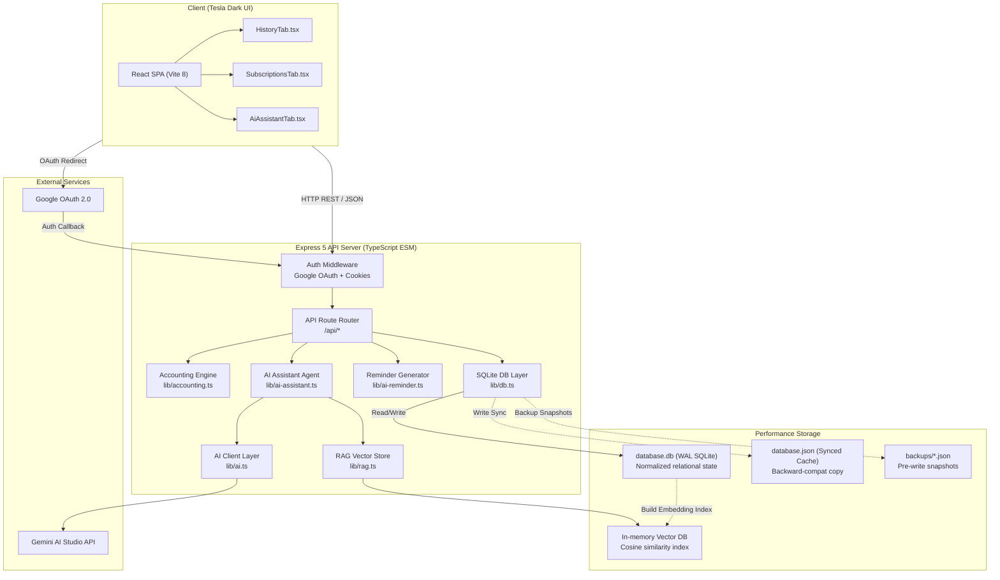

<picture>
  <source media="(prefers-color-scheme: dark)" srcset="https://capsule-render.vercel.app/api?type=waving&color=0:e82127,100:000000&height=220&section=header&text=Subscription%20Billing%20Ecosystem&fontSize=42&fontColor=fff&animation=fadeIn">
  
</picture>

<div align="center">

### **⚡️ Tesla-Inspired Minimalist Subscription Billing Ecosystem**
*A premium, high-performance, single-operator subscription billing console. Migrated to 100% TypeScript ESM, upgraded to a high-concurrency WAL SQLite relational database, and integrated with a lightning-fast Vitest suite.*

[](https://github.com/nnnc8/subscription-billing/actions/workflows/verify.yml)
[](https://nodejs.org)
[](https://www.typescriptlang.org)
[](https://react.dev)
[](https://sqlite.org)
[](https://vitest.dev)
[](src/index.css)

[Features](#features) • [System Architecture](#system-architecture) • [Tesla UI/UX Design System](#tesla-uiux-design-system) • [Quick Start](#quick-start) • [AI capabilities](#ai-capabilities) • [API Directory](#api-directory) • [Vitest Verification](#verification--testing)

</div>

---

## Technical Transformation Milestone (Phase 1-3)

We have successfully completed a major engineering refactor of the entire codebase from a legacy prototype to a high-end, scalable enterprise architecture:
*   **TypeScript ESM Migration**: Fully migrated both frontend and backend to **100% typed TypeScript ESM** with project references (`NodeNext` module resolution).
*   **SQLite Relational Upgrades**: Replaced legacy file persistence with a fully normalized relational **SQLite database (`better-sqlite3`)** executing in high-concurrency WAL mode, retaining a synced JSON file cache to preserve perfect backward compatibility.
*   **Vitest Test Suites**: Integrated the modern **Vitest testing runner** and migrated all unit/integration tests to TypeScript, executing a full test suite in under 30 milliseconds.
*   **Modular Component Splitting**: Deconstructed a monolithic 2,800+ line frontend file into highly isolated, typed, and clean React `.tsx` components (`HistoryTab.tsx`, `SubscriptionsTab.tsx`, `AiAssistantTab.tsx`).

---

## Features

| Capability | Technical Specifications |
| :--- | :--- |
| **📊 Cyber Dashboard** | High-contrast cards with dynamic member ledger breakdowns, real-time balance calculations, payment history, and temporal fee additions. |
| **🔒 Google Security Guard** | Cryptographically signed `HttpOnly` session cookies with Google OAuth authentication, restricted via specific email allowlists. |
| **🛢️ SQLite Relational DB** | 8 relational tables (`platforms`, `members`, `subscriptions`, etc.) with atomic transaction locks, schema validations, and high-concurrency WAL mode. |
| **📋 Subscription Dispatcher** | Per-member subscription mapping supporting fixed pricing as well as dynamic splits (equally dividing cost among active seats). |
| **🤖 AI Accounting Agent** | Natural-language chat powered by Google Gemini, featuring sequental tool calling and automated multi-turn reasoning on active databases. |
| **✍️ AI Reminders (5 Styles)** | LLM-generated payment reminders supporting 5 mood tones (friendly, business, poetic, pirate, urgent) with localized template fallbacks. |
| **🔍 In-Memory RAG Engine** | Embedded vector indexing (`gemini-embedding-2`) of transactional events with Cosine Similarity queries to feed contextual history to Gemini. |
| **📦 Backup & Rollback Logs** | Automated pre-write database backups with timestamp labels, size counts, and full restore-impact analysis previews. |
| **🕵️ Hash-Linked Ledger** | Tamper-evident accounting ledger linking events in a cryptographically secure hash-chain (SHA-256) to ensure absolute auditability. |

---

## System Architecture

Our newly refactored ESM architecture provides full isolation of duties across layers:



---

## Tesla UI/UX Design System

The console is fully styled with a high-end, premium design language inspired by Tesla's minimalist electric vehicle screens:

*   **Color Palette**: Pure deep black (`#000000`) background combined with performance red accents (`#e82127`) and subtle glowing neon elements.
*   **Precision Borders**: Thin, razor-sharp outlines (`rgba(255, 255, 255, 0.08)`) with minimalist `4px` borders, creating an industrial, solid, high-tech structure.
*   **Hyper-Smooth Easing**: Interactive transitions driven by Tesla’s signature bezier curves (`cubic-bezier(0.16, 1, 0.3, 1)`) for premium feedback response.
*   **Visual Ergonomics**: Spatial layout with high contrast, large numeric typography, frosted glass overlays (`backdrop-filter`), and tactical dashboard card metrics.

---

## Quick Start

### Prerequisites

*   **Node.js** 22+ and **pnpm** 11+
*   A Google Cloud console account with active OAuth Credentials

### 1. Clone & Dependencies

```bash
git clone https://github.com/nnnc8/subscription-billing.git
cd subscription-billing
pnpm install
```

### 2. Configure Environment

```bash
cp .env.example .env
```

Open `.env` and fill in the environment parameters:

```env
PORT=3000
HOST=127.0.0.1
APP_SESSION_SECRET=tesla_performance_secret_32_characters_long
GOOGLE_CLIENT_ID=your-google-oauth-client-id
GOOGLE_CLIENT_SECRET=your-google-oauth-client-secret
GOOGLE_ALLOWED_EMAILS=owner@example.com
```

### 3. Bootstrap & Boot

Run the production bundler to build client assets and spin up the TypeScript Express API server directly via `tsx` (no compiled Javascript files needed in the project directory!):

```bash
pnpm run build
pnpm run start
```

Open [http://localhost:3000](http://localhost:3000) and log in with an approved Google account.

---

## AI Capabilities

### 🤖 Multi-Turn AI Assistant
The chat assistant behaves like an elite financial operations assistant. It answers complex billing inquiries by sequentially and autonomously calling a rich set of system tools:
*   `get_member_balance`: Queries active member statements.
*   `get_member_history`: Reviews past payment ledgers.
*   `get_payment_records`: Collects full active payments history.
*   `get_accounting_warnings`: Pulls real-time accounting alerts.
*   `get_system_snapshot`: Obtains general system health state.
*   `get_close_preview`: Inspects month-close readiness blockages.

### 🔍 Custom Embedded RAG Engine
The built-in RAG pipeline uses `gemini-embedding-2` to vectorize all payments, fee adjustments, and member settings. It builds an in-memory vector index instantly on write. When querying AI, Cosine Similarity pulls the most relevant historical rows and injects them as trusted prompts to Gemini, providing context-aware responses with zero prompt bloat!

---

## API Directory

### Auth

*   `GET  /api/auth/login` - Triggers Google OAuth redirection.
*   `GET  /api/auth/callback` - Callback handler exchanging tokens and setting `HttpOnly` session cookies.
*   `POST /api/auth/logout` - Revokes session and deletes cookies.
*   `GET  /api/auth/session` - Verifies current user profile state.

### Operations & Configurations

*   `GET  /api/data` - Returns authoritative state mapped from WAL SQLite database.
*   `POST /api/payment` - Records payment (validating duplicate transactions within a 10-minute window).
*   `DELETE /api/payment/:id` - Voids payment and seals the change with the ledger event.
*   `POST /api/temp-charge` - Records a dynamic custom fee.
*   `POST /api/update-config-bundle` - Atomically commits bulk settings updates for platforms, price plans, bank accounts, and reminder tone styles.
*   `POST /api/settle` - Performs monthly period settlements, links rollover balance ledgers, and seals previous month history.

---

## Verification & Testing

Our testing environment uses **Vitest** for unit and accounting verification, combined with bash automation for general pipeline audits:

```bash
# Execute the full Vitest suite (18 modern TS assertions, runs in <30ms!)
pnpm test

# Run the complete end-to-end integration and verification pipeline
pnpm run verify

# Lint the workspace
pnpm run lint
```

`pnpm test` runs three fully typed, modern testing units:
1.  **`accounting.test.ts`**: Verifies 11 core accounting calculations including balance rollovers, voided payments, member archiving, duplicate charge rules, and ledger signatures.
2.  **`privacy.test.ts`**: Ensures sensitive configuration variables (`.env`, `database.json`, `.tmp` files) never leak into git-tracked trees.
3.  **`portability.test.ts`**: Validates cross-platform file paths and macOS Plist LaunchAgent service generators.

---

## Deployment

### Cloud Containers (Docker)
The modernized `Dockerfile` compiles Vite assets and launches our TSX server natively with minimal footprint:

```bash
docker compose up --build -d
```

### macOS Background Daemon
Run the console natively in the background of macOS. Our LaunchAgent installer automatically detects your local node runtime and builds a localized plist:

```bash
pnpm run launchd:install   # Installs background service daemon
pnpm run launchd:uninstall # Uninstalls background daemon
```

---

## License

MIT © 2026. This project is released for demonstration and educational portfolio purposes.
