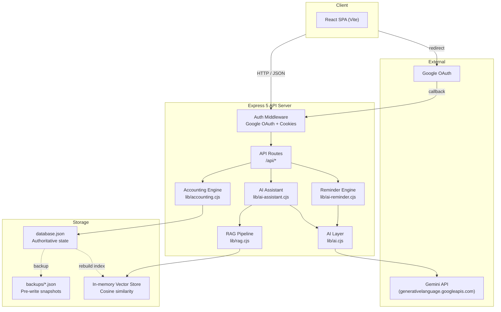
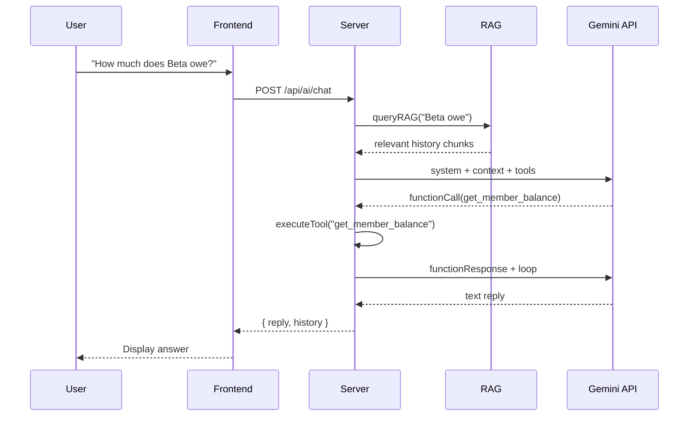

<picture>
  <source media="(prefers-color-scheme: dark)" srcset="https://capsule-render.vercel.app/api?type=waving&color=0:667eea,100:764ba2&height=200&section=header&text=Subscription%20Billing%20Console&fontSize=42&fontColor=fff&animation=fadeIn">
  
</picture>

<div align="center">

**Single-operator subscription billing console** — turn spreadsheet reconciliation into an auditable, AI-assisted web operations tool.

[](https://github.com/nnnc8/subscription-billing/actions/workflows/verify.yml)
[](https://nodejs.org)
[](https://react.dev)
[](https://expressjs.com)
[](LICENSE)
[](.github/PULL_REQUEST_TEMPLATE.md)

</div>

---

## Table of Contents

- [Features](#features)
- [Tech Stack](#tech-stack)
- [Architecture](#architecture)
- [Quick Start](#quick-start)
- [AI Capabilities](#ai-capabilities)
- [API Reference](#api-reference)
- [Project Structure](#project-structure)
- [Verification & Testing](#verification--testing)
- [Deployment](#deployment)
- [Contributing](#contributing)
- [License](#license)

---

## Features

| Area | Capabilities |
|------|-------------|
| **📊 Billing Dashboard** | Member cards with real-time balance, subscription fee breakdowns, payment tracking, temporary charges |
| **🔒 Authentication** | Google OAuth login with allowlisted emails, signed HttpOnly session cookies, 7-day expiry |
| **📋 Subscriptions** | Per-member subscription assignments, split/fixed billing modes, archive with data retention |
| **💰 Payment Ops** | Record payments & temp charges, duplicate detection, void transaction history |
| **📅 Monthly Close** | Close-readiness preview, balance rollover, history sealing, tamper-evident ledger |
| **🤖 AI Accounting Assistant** | Natural-language querying with function calling and RAG (Retrieval-Augmented Generation) |
| **✍️ AI Reminders** | Generate billing reminders in 5 tone styles via LLM, with automatic template fallback |
| **📦 Backup & Restore** | Automatic pre-write backups, backup inventory with restore-impact preview |
| **🕵️ Audit Trail** | Hash-linked ledger events, accounting warnings, system snapshot fingerprints |

---

## Tech Stack

```
Frontend         React 19  ·  Vite 8  ·  CSS (custom properties)
Backend          Express 5  ·  Node 20+
Auth             Google OAuth 2.0  ·  Signed HttpOnly cookies
AI               Google Gemini (AI Studio)  ·  In-memory vector store
Data             JSON file persistence  ·  50-backup rotation
CI               GitHub Actions  ·  Multi-Node matrix (20, 22, 24)
Deployment       Docker  ·  Railway-ready  ·  macOS LaunchAgent
```

---

## Architecture



**Request flow for an AI query:**



---

## Quick Start

### Prerequisites

- Node.js 20+ and pnpm 11+
- A Google Cloud OAuth client (for login)

### 1. Clone and install

```bash
git clone https://github.com/nnnc8/subscription-billing.git
cd subscription-billing
pnpm install
pnpm run build
```

### 2. Configure environment

```bash
cp .env.example .env
```

Edit `.env` with your Google OAuth credentials (see [Google Cloud Console](https://console.cloud.google.com/apis/credentials)):

```env
PORT=3000
HOST=127.0.0.1
APP_SESSION_SECRET=<32+ random characters>
GOOGLE_CLIENT_ID=<your-client-id>
GOOGLE_CLIENT_SECRET=<your-client-secret>
GOOGLE_ALLOWED_EMAILS=<your-email>
```

Add this authorized redirect URI in your OAuth client:

```
http://localhost:3000/api/auth/callback
```

### 3. Start

```bash
pnpm run start
```

Open [http://localhost:3000](http://localhost:3000) and sign in with your Google account.

### Docker (alternative)

```bash
docker compose up --build
```

Set the same environment variables via `.env` or `docker compose run -e`.

---

## AI Capabilities

### ✍️ AI Billing Reminders

Generate personalized billing messages with a single click. Supports five tone styles:

| Style | Description |
|-------|-------------|
| 💡 溫柔幽默 | Friendly, uses stickers and casual nicknames |
| 👔 專業商務 | Polite, professional, structured correspondence |
| 🏴‍☠️ 狂野海盜 | Pirate-themed with flair and attitude |
| 📜 文青詩意 | Poetic, philosophical, aesthetically warm |
| ⚡️ 急切催繳 | Urgent but polite, emphasizing prompt payment |

The feature **gracefully degrades** to a local template engine if the API is unreachable — zero disruption to the operator's workflow.

### 🤖 AI Accounting Assistant

An interactive chat assistant that answers natural-language billing questions:

- **Function calling**: autonomously invokes tools (`get_member_balance`, `get_member_history`, `get_payment_records`, `get_accounting_warnings`, `get_system_snapshot`, `get_close_preview`) to retrieve live data
- **Multi-turn reasoning**: calls multiple tools in sequence, feeding results back to the LLM for coherent answers
- **Context awareness**: maintains conversation history across turns

### 🔍 RAG Pipeline

Custom in-memory vector search indexes ledger events, history summaries, payments, and platform data:

1. **Indexing** — text chunks are embedded via `gemini-embedding-2` on write operations
2. **Retrieval** — user queries are embedded and matched via cosine similarity
3. **Generation** — top chunks are injected into the LLM prompt for grounded answers

This enables queries like *"How much did Beta pay in past months?"* without bloating the context window.

---

## API Reference

### Auth

| Method | Path | Description |
|--------|------|-------------|
| `GET` | `/api/auth/login` | Redirect to Google OAuth |
| `GET` | `/api/auth/callback` | OAuth callback handler |
| `POST` | `/api/auth/logout` | Clear session cookie |
| `GET` | `/api/auth/session` | Session status |

### Data Operations

| Method | Path | Description |
|--------|------|-------------|
| `GET` | `/api/health` | Health check |
| `GET` | `/api/data` | Full database state with audit |
| `POST` | `/api/payment` | Record a payment |
| `DELETE` | `/api/payment/:id` | Void a payment |
| `POST` | `/api/temp-charge` | Add a temporary charge |
| `DELETE` | `/api/temp-charge/:id` | Void a charge |
| `POST` | `/api/update-prices` | Update platform prices |
| `POST` | `/api/update-members` | Update member config |
| `POST` | `/api/update-subscriptions` | Update subscription assignments |
| `POST` | `/api/update-bank` | Update bank info & reminder style |
| `POST` | `/api/update-config-bundle` | Atomic config update |
| `POST` | `/api/member` | Add new member |
| `DELETE` | `/api/member/:id` | Archive member |
| `POST` | `/api/platform` | Add new platform |
| `DELETE` | `/api/platform/:id` | Archive platform |
| `POST` | `/api/settle` | Monthly settlement & rollover |
| `GET` | `/api/close-preview` | Close-readiness check |

### Backup

| Method | Path | Description |
|--------|------|-------------|
| `GET` | `/api/backups` | List all backups |
| `GET` | `/api/backups/:filename/preview` | Preview backup impact |
| `POST` | `/api/backups/restore` | Restore from backup |
| `POST` | `/api/backups/create` | Create manual backup |
| `DELETE` | `/api/backups/:filename` | Delete backup |

### AI

| Method | Path | Description |
|--------|------|-------------|
| `POST` | `/api/ai/generate-reminder` | Generate AI billing reminder |
| `POST` | `/api/ai/chat` | AI assistant conversation |
| `POST` | `/api/ai/rag-search` | Raw RAG vector search |

### Audit

| Method | Path | Description |
|--------|------|-------------|
| `GET` | `/api/audit` | Accounting warnings & ledger summary |
| `GET` | `/api/ledger` | Hash-chain event log |

> All `/api/*` routes except `/api/health` and `/api/auth/*` require a valid session cookie.

---

## Project Structure

```
subscription-billing/
├── .github/
│   ├── workflows/
│   │   └── verify.yml              # CI: lint, test, build, Docker
│   ├── PULL_REQUEST_TEMPLATE.md
│   └── ISSUE_TEMPLATE/
│       ├── bug_report.md
│       └── feature_request.md
├── public/
│   ├── favicon.svg
│   └── icons.svg
├── src/
│   ├── main.jsx                    # React entry
│   ├── App.jsx                     # Main application component
│   ├── App.css
│   └── index.css                   # Global styles & variables
├── lib/                            # Server-side logic
│   ├── accounting.cjs              # Core accounting engine
│   ├── ai.cjs                      # Gemini API client
│   ├── ai-reminder.cjs             # AI reminder generation
│   ├── ai-assistant.cjs            # AI assistant with function calling
│   ├── rag.cjs                     # RAG pipeline (index, embed, search)
│   ├── auth.cjs                    # Session & OAuth state management
│   ├── env.cjs                     # Environment loader
│   └── google-oauth.cjs            # Google OAuth client
├── scripts/
│   ├── test-auth.cjs               # Auth & API protection tests
│   ├── test-privacy.cjs            # Git privacy boundary tests
│   ├── test-portability.cjs        # LaunchAgent portability tests
│   └── install-launchagent.cjs     # macOS LaunchAgent installer
├── fixtures/
│   └── demo-database.json          # Demo data for first boot
├── docs/
│   └── recruiter-brief.md          # Short version for applications
├── server.cjs                      # Express server entry
├── vite.config.js
├── eslint.config.js
├── Dockerfile
├── docker-compose.yml
├── package.json
└── README.md
```

---

## Verification & Testing

```bash
# Full verification suite
pnpm run verify

# Linter
pnpm run lint

# Production build
pnpm run build
```

`pnpm run verify` runs:

| Check | Description |
|-------|-------------|
| Google auth & API protection | Confirms OAuth flow and session enforcement |
| Privacy boundary | Ensures no sensitive data in Git tracking |
| Accounting invariants | Validates balance calculations, history seals, and period consistency |
| Monthly rollover | Python script verifying rollover integrity |
| Portability | macOS LaunchAgent generation correctness |

---

## Deployment

### Railway / Cloud

```env
DATA_DIR=/data
HOST=0.0.0.0
PORT=3000
NODE_ENV=production
APP_SESSION_SECRET=<secret>
GOOGLE_CLIENT_ID=<id>
GOOGLE_CLIENT_SECRET=<secret>
GOOGLE_ALLOWED_EMAILS=<email>
```

Mount a persistent volume at `/data`. Add the deployment URL as an authorized redirect URI in Google Cloud Console.

### Docker

```bash
docker compose up --build -d
```

### macOS Service

```bash
pnpm run launchd:install   # Install as background service
pnpm run launchd:uninstall # Remove
```

---

## Contributing

This is primarily a portfolio project, but issues and pull requests are welcome.

1. Check open [issues](https://github.com/nnnc8/subscription-billing/issues) for discussion before starting work
2. Follow the [PR template](.github/PULL_REQUEST_TEMPLATE.md)
3. Ensure `pnpm run verify && pnpm run lint && pnpm run build` passes
4. Keep `.env`, `database.json`, and `backups/` out of Git

---

## License

MIT © 2026. This project is released for demonstration and educational purposes.
